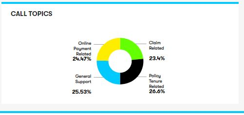

**D3.js**  
Data Driven Documents (D3.js) is a JavaScript library used to create visualizations of data using HTML, CSS, and SVG.  
It does this by binding data to the DOM (Document Object Model) and its elements and allowing them to transform when the data changes.  
  
**Installing D3**  
npm install d3 --save  

**Importing in React App**  
import * as d3 from d3  
_import everything into a namespace_   

**DonutChart**  
**_set the dimensions and margins of the graph_** 
drawDonutChart = (width, height, margin, data, colorData, divClass)  

**_The radius of the pieplot is half the width or half the height (smallest one). I subtract a bit of margin_**  
const radius = Math.min(width, height) / 2 - margin   

 **_append the svg object to the div called '.${divClass}'_**  
 d3.select(`.${divClass}`)  
           .append("svg")  
           .attr("width", width)  
           .attr("height", height) 
           .append("g")  
           .attr("transform", "translate(" + width / 2 + "," + height / 2 + ")")   
           
**_Creates arc_**  
 createArc = (radius, innerRadiusMultiplier, outerRadiusMultiplier) => {  
      return d3.arc() 
      .innerRadius(radius * innerRadiusMultiplier) // _This is the size of the donut hole_  
      .outerRadius(radius * outerRadiusMultiplier)}  
      
**_Build the Donut chart: Basically, each part of the Donut is a path that we build using the arc function._**  
createDonut = (svg, data_ready, arc, color) => { 
     svg  
     .selectAll('allSlices')  
     .data(data_ready)  
     .enter() 
     .append('path') 
     .attr('d', arc)  
     .attr('fill', function (d) {return (color(d.data.key)); })}  
     
**_Add the polylines between chart and labels(Labelling of data)_**  
createPolyLines = (svg, data_ready, arc, outerArc, radius) => { 
    svg 
    .selectAll('allPolylines')  
    .data(data_ready) 
    .enter()  
    .append('polyline')  
    .attr("stroke", "black") 
    .style("fill", "none")  
    .attr("stroke-width", 0.5)  
    .attr('points', (d) => {  
        var posA = outerArc.centroid(d); 
        var posB = outerArc.centroid(d);  
        var posC = outerArc.centroid(d);  
        var midangle = d.startAngle + (d.endAngle - d.startAngle) / 2;  
        posC[0] = radius * 0.9 * (midangle < Math.PI ? 1 : -1); 
        return [posA, posB, posC];  
       });  
    }   
    
**_Generate Text_**   
writeKeys = (text, outerArc, radius) => {  
    text.append('text')  
    .attr('transform', (d) => {  
        var pos = outerArc.centroid(d);  
        var midangle = d.startAngle + (d.endAngle - d.startAngle) / 2;  
        pos[0] = radius * 0.99 * (midangle < Math.PI ? 1 : -1);  
        pos[1] = pos[1] + 1 ;  
        return 'translate(' + pos + ')';  
        })  
        .attr("font-family", "GT Walsheim Pro Regular")  
        .attr("font-size", "12px")  
        .attr("font-weight", "bold")  
        .style('text-anchor', (d) => {  
            var midangle = d.startAngle + (d.endAngle - d.startAngle) / 2;  
            return (midangle < Math.PI ? 'start' : 'end');  
            })  
            
**_Word Wrapping of data_**   
     .each(function (d) {  
         var arr = d.data.key.split(" ");  
            if (arr !== undefined) {  
                 for (var i = 0; i < arr.length; i++) {  
                     d3.select(this).append("tspan")  
                       .text(arr[i])  
                       .attr("dy", i ? "0.9rem" : 0)  
                       .attr("x", 0)  
                       .attr("text-anchor", "left")  
                       .attr("class", "tspan" + i);  
                       }  
                    }  
                })  
            }     
            
**_Generates the numerical values i.e,Percentages_**    
writeValues = (text, outerArc, radius) => {  
       text.append('text')  
         .text(function (d) { return (d.data.value + "%"); })  
         .attr('transform', (d) => {  
             var pos = outerArc.centroid(d);  
              var midangle = d.startAngle + (d.endAngle - d.startAngle) / 2;  
               pos[0] = radius * 0.99 * (midangle < Math.PI ? 1 : -1);  
               pos[1] = pos[1] + 45;  
            return 'translate(' + pos + ')';  
            })  
        .attr("font-family", "GT Walsheim Pro Bold") 
        .attr("font-size", "15px")  
        .style('text-anchor', (d) => {  
            var midangle = d.startAngle + (d.endAngle - d.startAngle) / 2; 
            return (midangle < Math.PI ? 'start' : 'end');  
            })  
         }  
  
  

      
    

